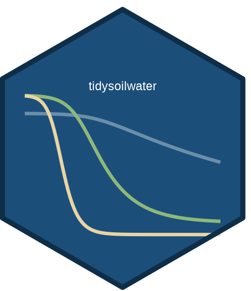

# tidysoilwater 

<!-- badges: start -->
[](https://lifecycle.r-lib.org/articles/stages.html#stable)
[](https://github.com/Taakefyrsten/tidysoilwater/actions/workflows/R-CMD-check.yaml)
<!-- badges: end -->

Tidy tools for **soil water retention** and **unsaturated hydraulic
conductivity** modelling. Pipe-compatible functions that accept and return
tibbles, with tidy evaluation support for column arguments.
Implements the Van Genuchten (1980) / Mualem (1976) model family with
parameter fitting from measured (h, θ) data.

## Installation

```r
# Install from GitHub:
pak::pak("Taakefyrsten/tidysoilwater")
```

## Quick start

```r
library(tidysoilwater)
library(tibble)

# Soil water retention curve for a loam soil
soil <- tibble(h = c(0, 10, 33, 100, 330, 1000, 5000, 15000))

swrc_van_genuchten(soil,
  theta_r = 0.065, theta_s = 0.41,
  alpha = 0.075, n = 1.89, h = h)

# Fit parameters from observed data
observed <- tibble(
  h     = c(0, 10, 100, 1000, 5000, 15000),
  theta = c(0.44, 0.40, 0.32, 0.20, 0.12, 0.08)
)

fit_swrc(observed, theta_col = theta, h_col = h)
```

## Multi-pedon workflows

Group your data with `dplyr::group_by()` and `fit_swrc()` fits each group
independently. Use `workers` for parallel fitting on Unix:

```r
library(dplyr)

pedons |>
  group_by(pedon_id) |>
  fit_swrc(theta_col = theta, h_col = h,
           workers = parallel::detectCores(logical = FALSE))
```

## Performance

| Task | Time |
|------|------|
| SWRC for 1 000 000 rows | < 20 ms |
| K(h) for 1 000 000 rows | < 40 ms |
| Fit 500 pedons (4 cores) | < 2 s |

## Learn more

* `vignette("soil-water-retention")` — Van Genuchten model parameters
* `vignette("hydraulic-conductivity")` — Mualem-Van Genuchten K(h)
* `vignette("fitting-diagnostics")` — convergence, residuals, uncertainty
* `vignette("pedotransfer")` — PTF-based parameter estimation from texture
* `vignette("multi-pedon-workflow")` — large-scale parallel fitting

Full documentation: <https://taakefyrsten.github.io/tidysoilwater>
